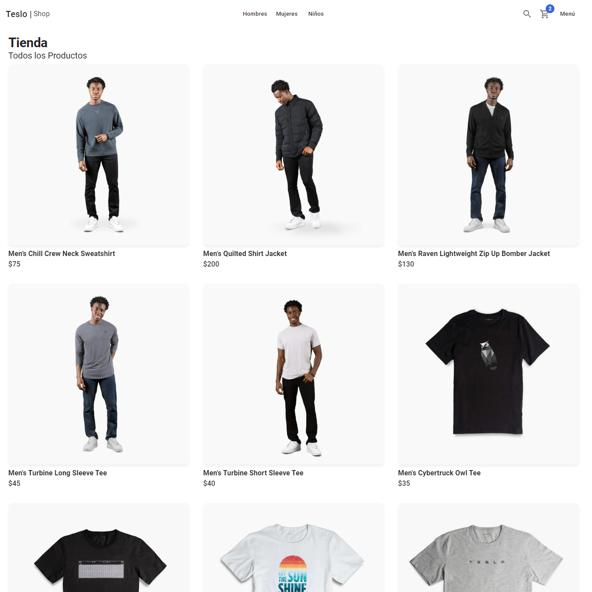
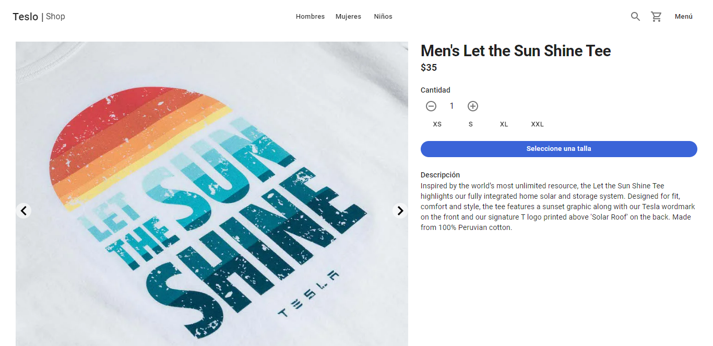
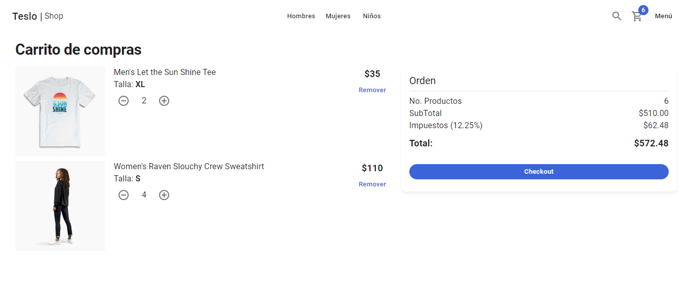
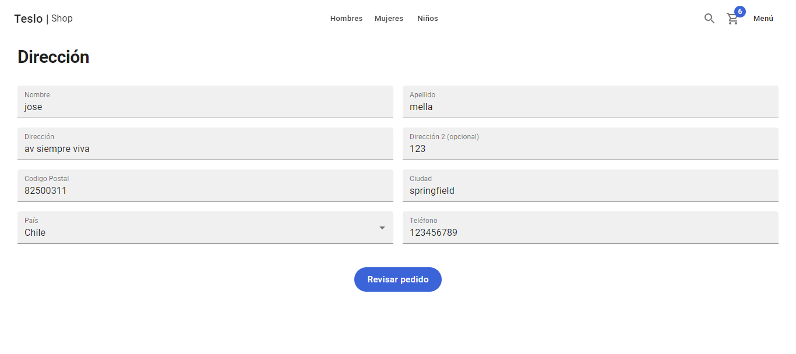
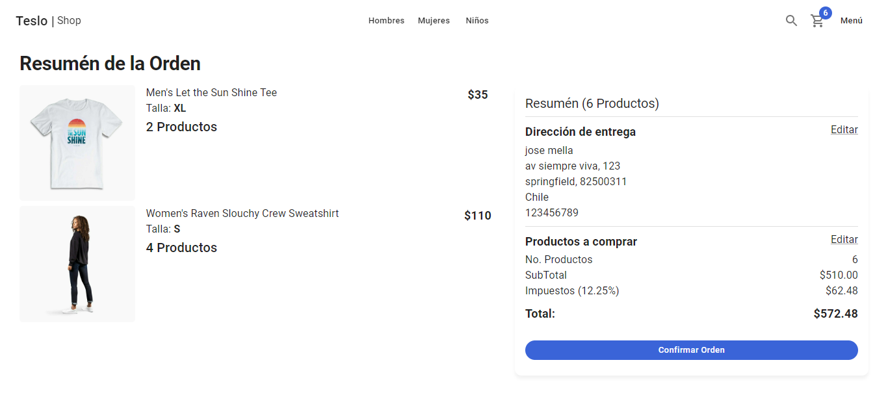

<!-- <div style="display:flex; justify-content:center; align-items:center; width:100%;"> -->
<h1 > Next.js Teslo Shop</h1>
<!-- </div> -->

<p>Teslo Shop es una E-Comerce app creada en <b>Nextjs</b> escrita en <b>Typescript</b></p>
<p>Se inspiro en la tienda de ropa de la empresa Tesla, es una</p>
<p>Se puede encontrar las siguientes páginas:</p>
<ul>
<li><p><b>Home</b>: pagina donde se ve los productos, el navbar y el menu lateral</p></li>
<li><p><b>product/[slug]</b>: pagina que muestra el detalle de cada producto seleccionado</p></li>
</ul>

<h2>Get Start</h2>
Los pasos para levantar el proyecto OpenJira en desarrollo usando docker, mongodb y nextjs:

### Levantar la base de datos

```
docker-compose up -d
```

- El -d, significa **detache**

### Configurar las variables de entrono

- Renombrar el archivo **.env.templante** a **.env**

- MOngoDB URL Local:

```
mongodb://localhost:27017/teslodb
```

### Reconstruir los modulos de Node y levantar Nextjs

```
npm install
npm run dev
```

### Llenar la base de datos de informacion de prueba

- llamar a:

```
http://localhost:3000/api/seed
```

### Imagenes de la App

<br>
<br>
<br>
<br>
<br>
